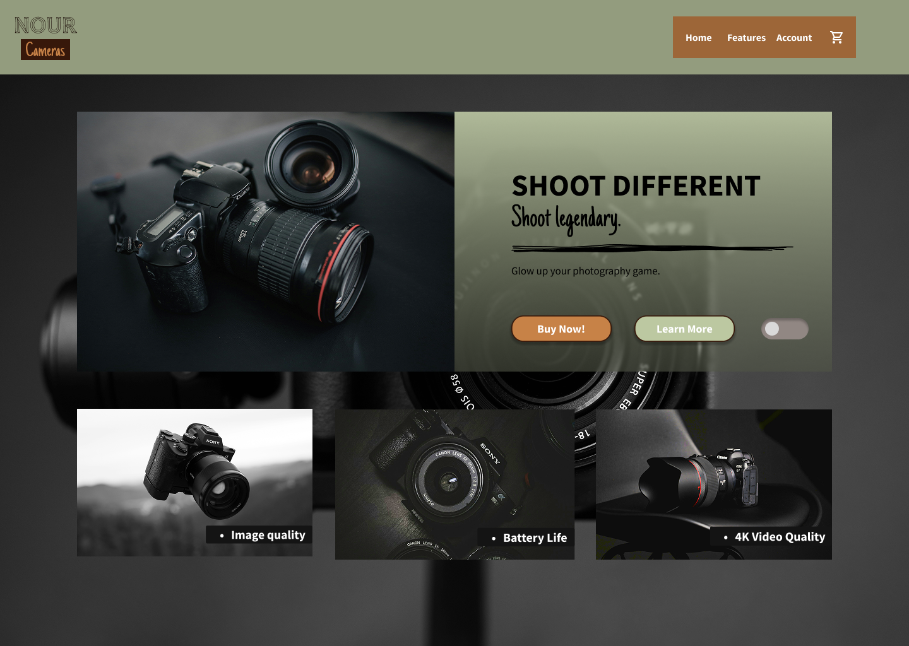
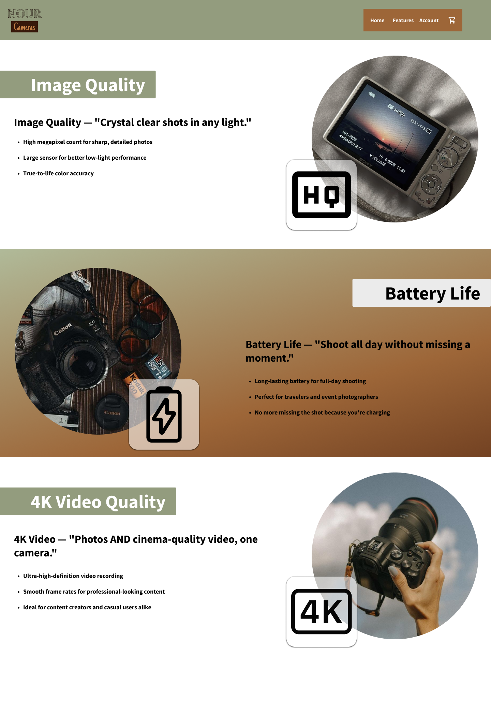
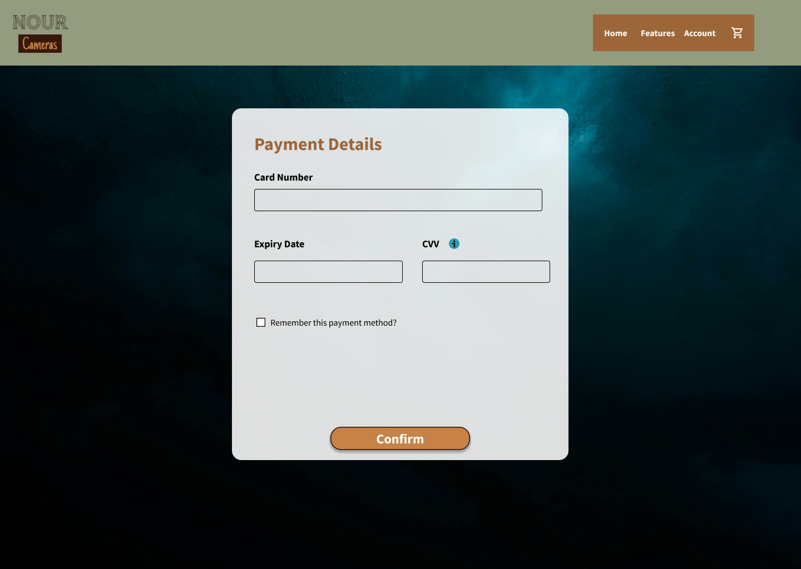
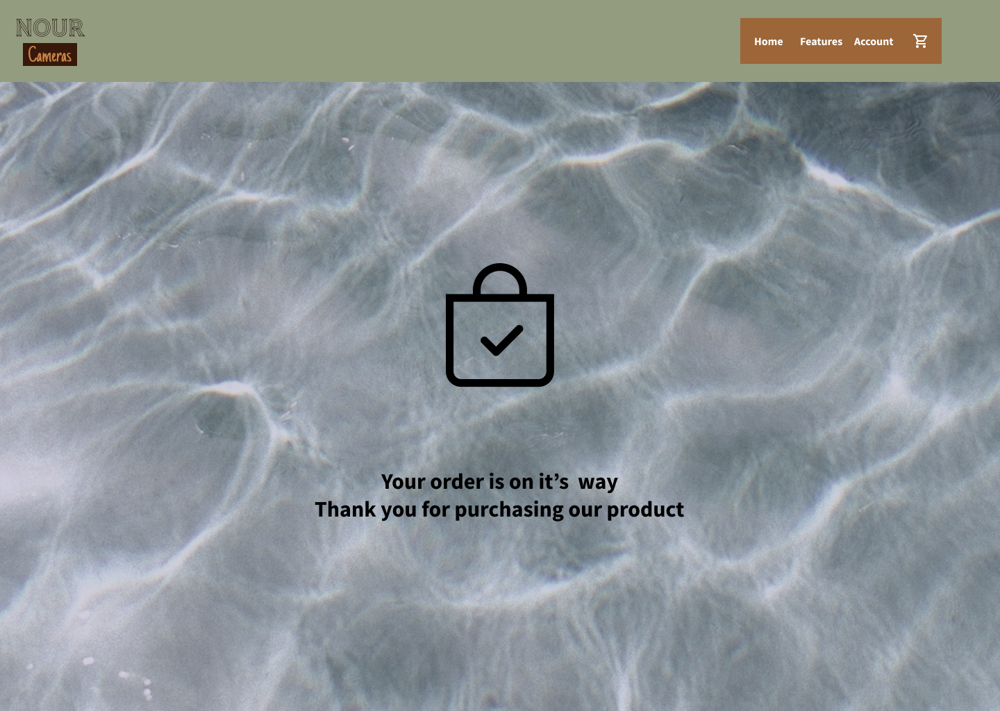

# Nour Cameras – UX Web Design Project

A UX/UI case study for **Nour Cameras**, a fictional e-commerce website concept for selling cameras online. This project focuses on designing a clean, intuitive shopping experience from browsing to purchase confirmation.

## 🎯 Overview
The goal was to design a user-friendly online camera store that makes it easy for customers to browse products, view detailed specifications, and complete a purchase with minimal friction.

## 👤 Role
Solo UX/UI Designer — responsible for the full design process: wireframing, visual design, and prototyping.

## 🛠️ Tools
- **Figma** — wireframing, UI design, and prototyping

## 📱 Pages Designed
- **Home Page** — product highlights and navigation entry point
- **Product Details Page** — specs, images, and pricing for individual cameras
- **Checkout Page** — order summary and payment flow
- **Confirmation Page** — order success and next steps

## 🖼️ Preview

## 🔗 View the Full Design
[Open in Figma](https://www.figma.com/design/XwDRVBuDa5WpNyroRTn1ZX/Nour-Cameras--v1?node-id=29-3&t=PvlnZ42gvcQWyarV-1)

## 💡 Design Considerations
- Clear visual hierarchy to highlight product imagery and pricing
- Simple, low-friction checkout flow to reduce cart abandonment
- Consistent layout and spacing across all pages for a cohesive shopping experience
